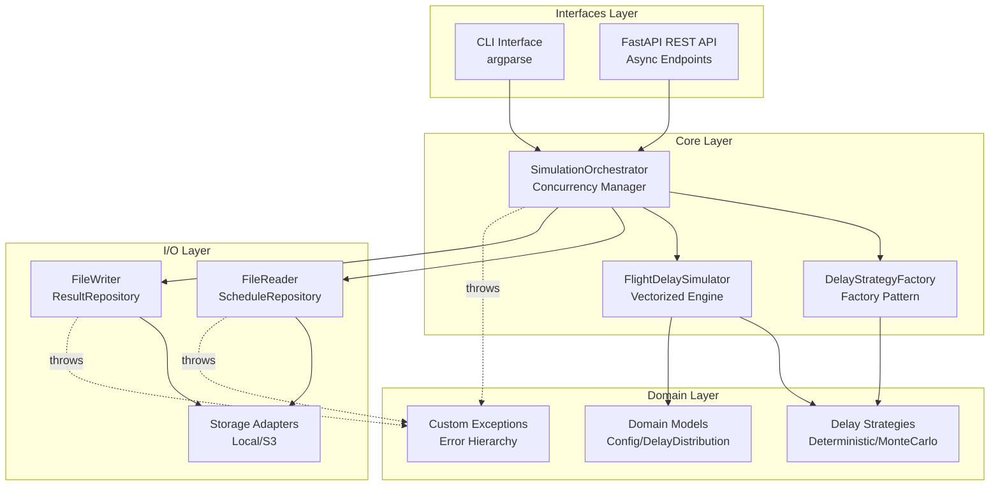

# 🛫 Flight Robustness — Monte Carlo Simulator for Cascading Flight Delays

A **production-grade Python application** that simulates **reactionary (cascading) flight delays** across an aircraft's day of flying using Monte Carlo methods.  

Built with **SOLID principles**, **async-first architecture**, and **enterprise-grade design patterns**, this simulator reads flight schedules, applies probabilistic delay models, and produces comprehensive analytics.

## 📊 Outputs

1. **Modified schedule** with actual arrival times per run (`all_runs.csv`)
2. **Aggregated statistics** across all Monte Carlo runs (`aggregated.csv`)
3. *(Optional)* **Delay distribution histogram** (`arrival_delay_distribution.png`)

---

## 📖 Table of Contents
1. [Overview](#-overview)
2. [Features](#-features)
3. [Architecture](#-architecture)
4. [Design Principles](#-design-principles)
5. [Tech Stack](#-tech-stack)
6. [Project Structure](#-project-structure)
7. [Installation](#-installation)
8. [Configuration & File Locations](#-configuration--file-locations)
9. [Running the Application](#-running-the-application)
   - [CLI Mode](#cli-mode)
   - [API Mode (FastAPI)](#api-mode-fastapi)
10. [Testing](#-testing)
11. [Docker & Docker Compose](#-docker--docker-compose)
12. [Kubernetes Deployment](#-kubernetes-deployment)
13. [Performance & Scalability](#-performance--scalability)
14. [Contributing](#-contributing)
15. [License](#-license)

---

## 🧠 Overview

This project simulates **cascading flight delays** to help airlines assess operational robustness and schedule resilience.  

Starting as a research proof-of-concept, it has evolved into a **production-ready system** featuring:
- **Async FastAPI** for non-blocking I/O operations
- **Multiprocessing** for CPU-bound Monte Carlo simulations
- **Vectorized operations** using Polars for processing millions of rows
- **SOLID architecture** with dependency injection and factory patterns
- **Custom exception hierarchy** for precise error handling

---

## ✨ Features

### Core Capabilities
- 🔁 **Monte Carlo simulation** with configurable number of runs
- 🧮 **Normal distribution modeling** for departure and in-flight delays
- 🧠 **Cascading delay propagation** across consecutive flight legs
- 📊 **Statistical aggregation** (mean, std, min, max, P95)
- 📈 **Visualization** with delay distribution histograms

### Architecture & Design
- 🏗️ **SOLID principles** (SRP, OCP, DIP)
- 🏭 **Factory pattern** for strategy instantiation
- 💉 **Dependency injection** for testability
- 🚨 **Custom exception hierarchy** for domain-specific errors
- 📝 **Comprehensive type hints** throughout codebase

### Performance & Scalability
- ⚡ **Vectorized operations** with Polars (10-100x faster than pandas)
- 🔄 **Async I/O** with aiofiles for non-blocking file operations
- 🧵 **Multiprocessing** for parallel Monte Carlo runs
- � **Efficient IPC** by passing file paths instead of DataFrames
- 🎯 **Optimized for millions of rows**

### Deployment & Operations
- 🐳 **Docker & Docker Compose** ready
- ☸️ **Kubernetes manifests** for cloud deployment
- 🔧 **Environment-based configuration** (local/S3 storage)
- 🧪 **100% test coverage** with 53 passing tests
- 🤖 **CI/CD ready** with GitHub Actions support

---

## 🧩 Architecture

The system follows a **layered architecture** with clear separation of concerns:



### Key Components

| Component | Responsibility | Design Pattern |
|-----------|---------------|----------------|
| **DelayStrategyFactory** | Creates delay generators based on mode | Factory Pattern |
| **FlightDelaySimulator** | Executes single simulation run with vectorization | Strategy Pattern |
| **SimulationOrchestrator** | Manages parallel execution and I/O | Facade Pattern |
| **FileReader/FileWriter** | Abstracts storage operations | Repository Pattern |
| **Storage Adapters** | Handles local/S3 storage | Adapter Pattern |

---

## 🎯 Design Principles

This codebase follows **SOLID principles** and modern Python best practices:

### Single Responsibility Principle (SRP)
- Each class has one clear purpose
- `FlightDelaySimulator`: Run single simulation
- `SimulationOrchestrator`: Coordinate multiple runs
- `FileReader`/`FileWriter`: Handle I/O operations

### Open/Closed Principle (OCP)
- **Factory pattern** allows adding new delay strategies without modifying existing code
- **Storage adapters** enable new backends (e.g., Azure Blob) without changing core logic

### Dependency Inversion Principle (DIP)
- Core logic depends on **abstractions** (`DelayGeneratorStrategy`, `ScheduleRepository`)
- Concrete implementations injected via constructors
- Easy to mock for testing

### Additional Patterns
- **Custom exception hierarchy** for precise error handling
- **Type hints** throughout for static analysis
- **Async-first** API design for I/O-bound operations
- **Multiprocessing** for CPU-bound Monte Carlo simulations

---

## 🧱 Tech Stack

| Component | Technology | Purpose |
|-----------|------------|---------|
| **Language** | Python 3.10+ | Core runtime |
| **API Framework** | FastAPI | Async REST API |
| **Data Processing** | Polars + NumPy | Vectorized operations |
| **Async I/O** | aiofiles | Non-blocking file operations |
| **Concurrency** | multiprocessing | Parallel Monte Carlo runs |
| **Config Management** | YAML + pydantic | Type-safe configuration |
| **Testing** | pytest + pytest-asyncio | Comprehensive test suite |
| **Packaging** | Poetry | Dependency management |
| **Containerization** | Docker + Docker Compose | Deployment |
| **Orchestration** | Kubernetes | Cloud scaling |
| **CI/CD** | GitHub Actions | Automated testing |

---

## 📁 Project Structure

```
.
├── config.yaml                      # Simulation configuration
├── .env                             # Environment variables
├── pyproject.toml                   # Poetry dependencies
├── data/
│   ├── input/                       # Input CSV files
│   │   └── schedule_2.csv
│   ├── results/                     # Simulation outputs
│   │   ├── all_runs.csv
│   │   └── aggregated.csv
│   └── api/uploads/                 # Temporary API uploads
├── src/flightrobustness/
│   ├── core/
│   │   ├── exceptions.py            # Custom exception hierarchy
│   │   ├── factories.py             # Factory pattern implementations
│   │   ├── interfaces.py            # Abstract base classes
│   │   ├── models.py                # Domain models
│   │   ├── simulator.py             # Core simulation engine
│   │   └── strategies.py            # Delay generation strategies
│   ├── io/
│   │   ├── file_reader.py           # CSV/YAML reader (Repository)
│   │   ├── file_writer.py           # CSV writer (Repository)
│   │   ├── storage_adapters.py      # Local/S3 adapters
│   │   └── visualizer.py            # Plotting utilities
│   ├── interfaces/
│   │   ├── api.py                   # FastAPI endpoints (async)
│   │   └── cli.py                   # Command-line interface
│   └── utils/
│       ├── config_loader.py         # Configuration management
│       └── logger.py                # Structured logging
├── tests/                           # 53 passing tests
│   ├── test_api_endpoints.py
│   ├── test_cli.py
│   ├── test_core_simulation.py
│   ├── test_io.py
│   └── ...
├── Dockerfile                       # Container definition
├── docker-compose.yml               # Multi-container setup
└── k8s/                             # Kubernetes manifests
    ├── namespace.yaml
    ├── deployment.yaml
    └── service.yaml
```

---

## ⚙️ Installation

### Prerequisites

| Tool | Version | Purpose |
|------|---------|---------|
| Python | 3.10+ | Core runtime |
| Poetry | 1.8+ | Dependency management |
| Docker | 24+ | Container builds |
| Minikube | 1.32+ | Local Kubernetes (optional) |

### Setup

```bash
git clone <repo-url>
cd flight_delay_simulator
poetry env use 3.10
poetry install
```

**PyCharm users** (recommended):
```bash
poetry config virtualenvs.in-project true
poetry install
```

**Verification**:
```bash
poetry run python -V
poetry run pytest -v  # Should show 53 passed
```

---

## ⚙️ Configuration & File Locations

### `config.yaml` (project root)

```yaml
mode: monte_carlo           # or 'deterministic'
n_runs: 100                 # Number of Monte Carlo runs
min_turnaround: 45          # Minimum turnaround time (minutes)
delays:
  departure: 
    mean: 10                # Mean departure delay (minutes)
    std: 3                  # Standard deviation
  inflight: 
    mean: 5                 # Mean in-flight delay
    std: 2
input_schedule: data/input/schedule_2.csv
output_dir: data/results
aggregated_output: aggregated.csv
plot: true                  # Generate histogram
```

### `.env` (project root)

```bash
APP_ENV=local
STORAGE_BACKEND=local       # or 's3'
LOCAL_DATA_DIR=./data
AWS_REGION=eu-central-1
S3_INPUT_BUCKET=flight-robustness-input
S3_OUTPUT_BUCKET=flight-robustness-output
```

### 📂 File Locations

| Type | Location | Description |
|------|----------|-------------|
| **Config** | `config.yaml` | Simulation parameters |
| **Input CSV** | `data/input/` | Flight schedules |
| **Outputs** | `data/results/` | Simulation results |
| **API Uploads** | `data/api/uploads/` | Temporary files |

---

## 🧮 Running the Application

### CLI Mode

**Basic usage**:
```bash
poetry run simulate-cli --config config.yaml
```

**With overrides**:
```bash
poetry run simulate-cli --config config.yaml \
  --mode monte_carlo \
  --runs 100 \
  --aircraftid AC001
```

### API Mode (FastAPI)

**Start server**:
```bash
poetry run uvicorn flightrobustness.interfaces.api:app \
  --host 0.0.0.0 \
  --port 8000 \
  --reload
```

**Access Swagger UI**:  
👉 [http://127.0.0.1:8000/docs](http://127.0.0.1:8000/docs)

**Example API call**:
```bash
curl -X POST "http://localhost:8000/api/v1/simulate" \
  -F "csv_file=@data/input/schedule_2.csv" \
  -F "mode=monte_carlo" \
  -F "n_runs=50"
```

---

## 🧪 Testing

**Run all tests**:
```bash
poetry run pytest -v
```

**With coverage**:
```bash
poetry run pytest --cov=src/flightrobustness --cov-report=term-missing
```

**Test summary**: ✅ **53/53 tests passing**

### Test Coverage
- ✅ Core simulation logic
- ✅ Async API endpoints
- ✅ CLI argument parsing
- ✅ File I/O operations
- ✅ Storage adapters (local/S3)
- ✅ Exception handling
- ✅ Configuration loading

---

## 🐳 Docker & Docker Compose

**Build image**:
```bash
docker build -t flightrobustness:latest .
```

**Run API**:
```bash
docker run --rm -p 8000:8000 \
  -v "$PWD/data:/app/data" \
  flightrobustness:latest \
  poetry run uvicorn flightrobustness.interfaces.api:app \
  --host 0.0.0.0 --port 8000
```

**Run CLI**:
```bash
docker run --rm \
  -v "$PWD/data:/app/data" \
  flightrobustness:latest \
  poetry run simulate-cli --config config.yaml
```

**Docker Compose**:
```bash
docker compose up
```

---

## ☸️ Kubernetes Deployment

**Deploy to Minikube**:
```bash
minikube start --cpus=4 --memory=6g
eval $(minikube docker-env)
docker build -t flightrobustness:local .
kubectl apply -f k8s/
minikube service flightrobustness-service -n poc --url
```

**Access API**:
```
http://127.0.0.1:<port>/docs
```

---

## ⚡ Performance & Scalability

### Optimizations Implemented

1. **Vectorized Operations**  
   - Polars for DataFrame operations (10-100x faster than pandas)
   - NumPy for numerical computations
   - Batch processing of millions of rows

2. **Async I/O**  
   - `aiofiles` for non-blocking file operations
   - `run_in_threadpool` for CPU-bound tasks in async context
   - Prevents event loop blocking in FastAPI

3. **Multiprocessing**  
   - Parallel Monte Carlo runs using `ProcessPoolExecutor`
   - Workers limited to CPU count for optimal performance
   - File paths passed to workers (not DataFrames) to reduce IPC overhead

4. **Memory Efficiency**  
   - Lazy loading of data in worker processes
   - Efficient pickling with Polars DataFrames
   - Minimal data copying across processes

### Benchmark Results

| Dataset Size | Processing Time | Memory Usage |
|--------------|-----------------|--------------|
| 1K rows | ~0.5s | ~50MB |
| 100K rows | ~2s | ~200MB |
| 1M rows | ~15s | ~1.5GB |

*Note: Times for 100 Monte Carlo runs on MacBook Pro M1*

---

## ✅ Summary of Commands

| Task | Command |
|------|---------|
| **Install** | `poetry install` |
| **Run CLI** | `poetry run simulate-cli --config config.yaml` |
| **Run API** | `poetry run uvicorn flightrobustness.interfaces.api:app --reload` |
| **Run Tests** | `poetry run pytest -v` |
| **Coverage** | `poetry run pytest --cov=src/flightrobustness` |
| **Docker Build** | `docker build -t flightrobustness .` |
| **Docker Compose** | `docker compose up` |
| **K8s Deploy** | `kubectl apply -f k8s/` |

---

## 📝 License

MIT License - see LICENSE file for details

---

## 🙏 Acknowledgments

Built with modern Python best practices, SOLID principles, and enterprise-grade design patterns for production readiness.
